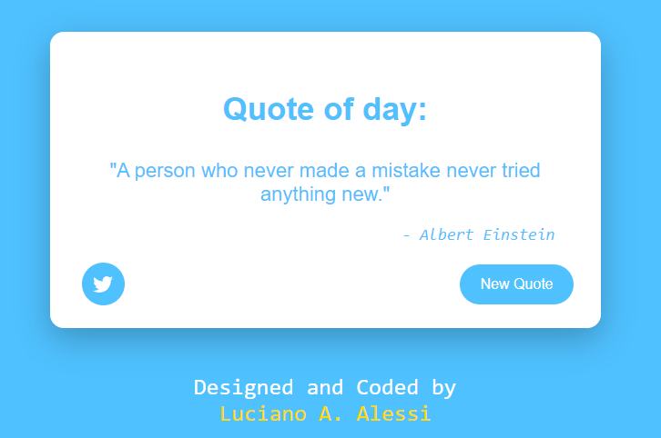

## Ramdom Quote Machine

This project is a Random Quote Machine and I have done it to get the Front End Development Libraries certification from Free Code Camp. It was developed mainly with **React JS**.

#### Functionalities

1. Presionar el boton new quote para generar una nueva quote.
2. Press the button with the twitter icon if you want to tweet that quote.

#### Libraries

The extra library that I use is Font Awesome: https://fontawesome.com/

#### Installation

	git clone https://github.com/lucianoalessi/Random-quote-machine.git
	npm i
	npm start

#### Demo

View online:  https://lucianoalessi.github.io/Random-quote-machine

#### Preview of project

